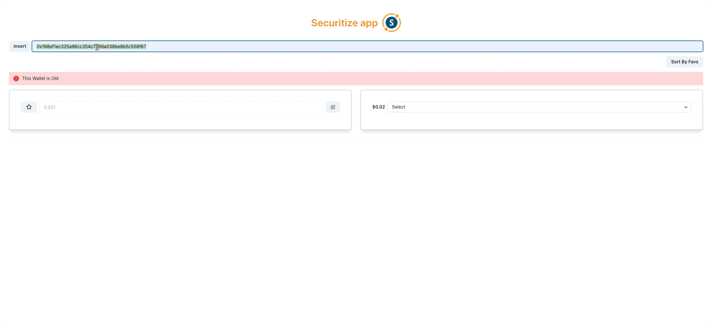

# React + TypeScript + Vite
# Frontend app

This is a challenge for Securitize io

## Build with 🛠️ bootstraped by Vite

* [React](https://es.reactjs.org/docs) - Frontend JS Library -React v18- 
* [TypeScript](https://www.typescriptlang.org/docs/) - Typos
* [Chackra UI](https://chakra-ui.com/getting-started) - Styles -
* [pnpm ](https://pnpm.io/es/) - package manager -

## Get started with this application 🚀

### Pre-requisites 📋

You have to install Nest JS, pnpm, Chakra UI ans Typescript.

The followings websites to get started:
- https://nestjs.com/
- https://docs.cypress.io/guides/overview/why-cypress/
- https://chakra-ui.com/
- https://pnpm.io/es/

## Deployment 📦

If you want to run this app, you can open a terminal, and write: git clone https://github.com/sanchezdamianj/securitize-fe.git

After that, write pnpm i in your terminal.

# Getting Started with Vite React Typescript App

This project was bootstrapped with [pnpm create vite](https://vitejs.dev/guide/).

## Available Scripts

In the project directory, you can run:
### `pnpm dev`
    -   Inside of src folder, open a terminal
    -   This server runs in PORT 5173
    -   Run the following command
    -   pnpm dev

* Disclaimer: you can run the app using npm too.

Runs the app in the development mode.\
Open [http://localhost:5173](http://localhost:5173) to view it in your browser.

## Versioned 📌

Using [git](http://git.io/) to the versioned. All Versions availables, look at [tags in the repository](https://github.com/sanchezdamianj/securitize-fe).

## Author ✒️
* **Damian Javier Sanchez** - *Frontend Proyect* - [sanchezdamianj](https://github.com/sanchezdamianj)
## Skills to create this project ✒️

## Licencia 📄

This project is property of Damian Javier Sanchez

---
⌨️ with ❤️ by [sanchezdamianj](https://github.com/sanchezdamianj/securitize-fe) 😊

